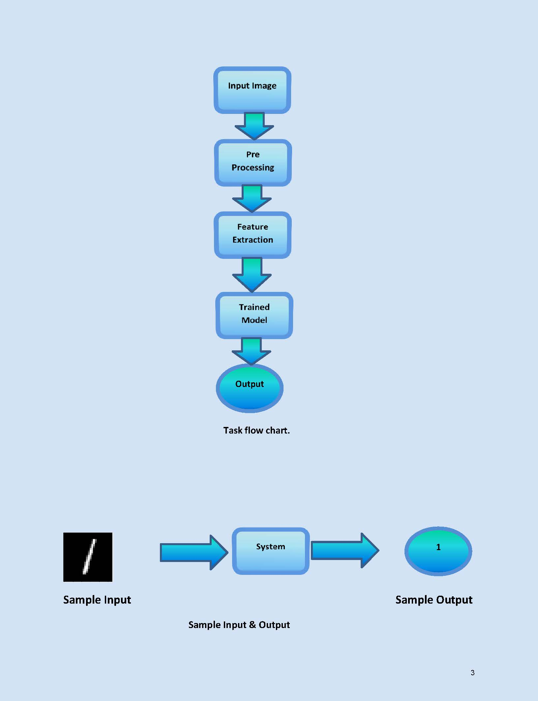
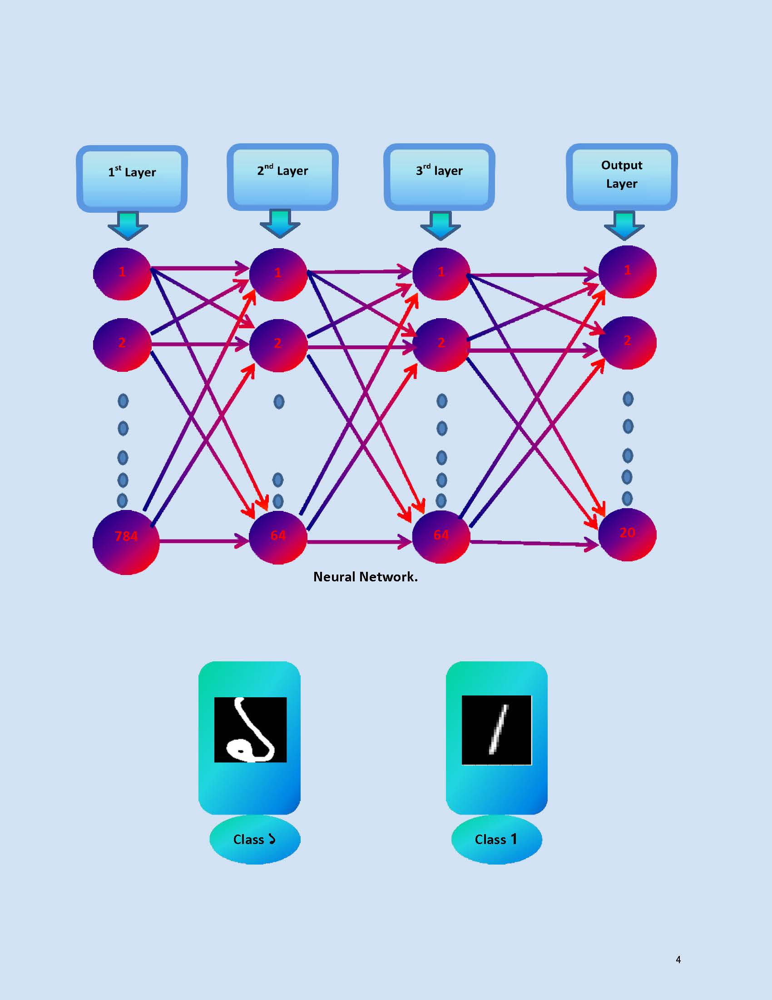
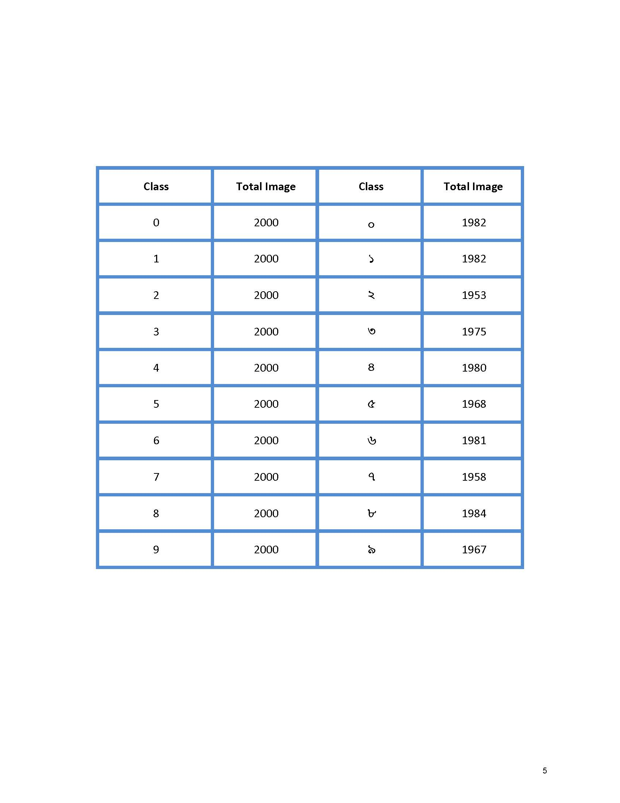
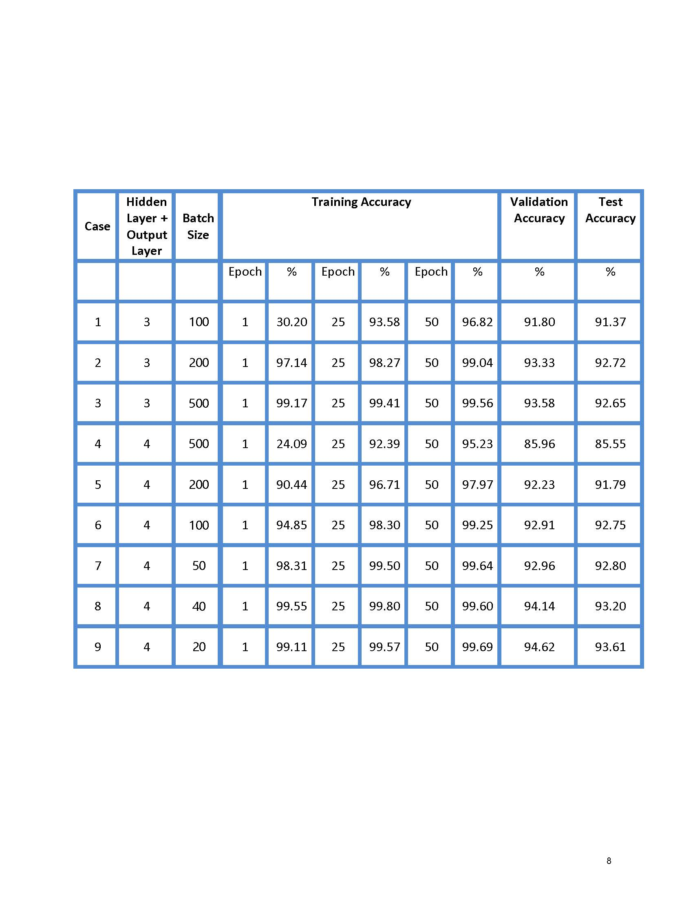
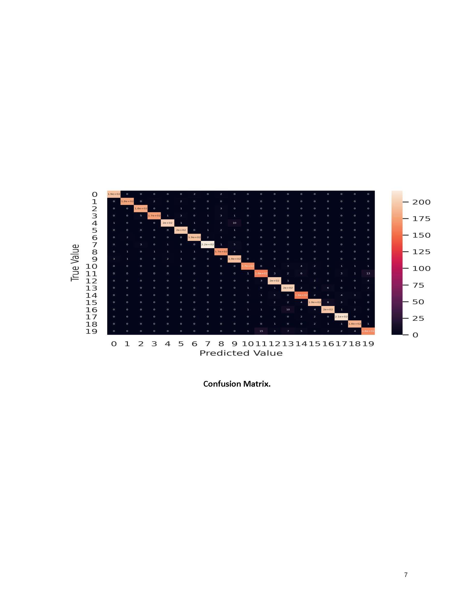
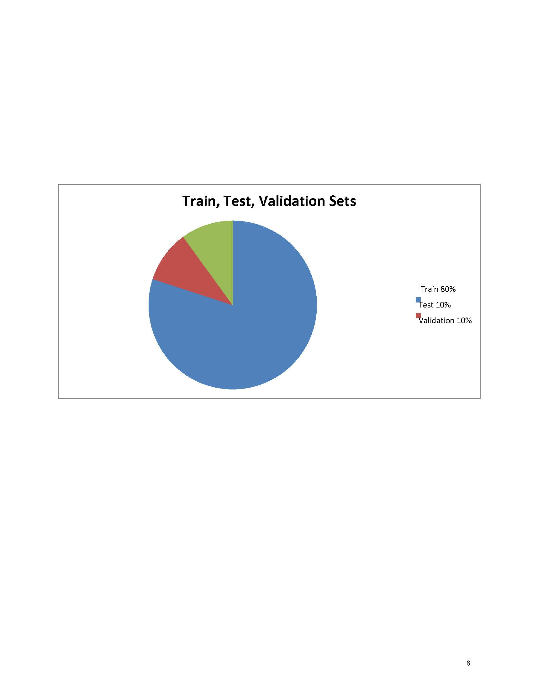

# Hand-Written-Bangla-And-English-Digit-Recognition
<b><i>CSE 4.2 SOFT COMPUTING PROJECT.</i></b>

## :arrow_forward:<mark>PROJECT ARCHITECTURE</mark>

## :arrow_forward:<mark>PROJECT RESULT</mark>

